<!--最終レポート 
あとはキオスクとかだけ-->

  <h1>CE計画(東京駅新幹線対面乗り換えプロジェクト)
  </h1>

  <h3>学籍番号  名前</h3>

## 1. 概要・目的

CE計画は、リニア新幹線開業に伴い、東京駅の東海道新幹線ホームの14番線をひっ迫している東北新幹線ホームに転用し、14,15番線ホームにて両新幹線の対面乗り換えができるようにする計画である。これにより、東北新幹線のホームの混雑緩和や、両新幹線の乗り換えの利便性向上が期待されている。両新幹線の直通計画とは異なり、異なる電化の周波数の問題や遅延や車両運用トラブルの相互波及を回避することができるため、実現可能性が高いとされている。

## 2. 具体的な計画

①現状

<table align="center" style="border: none;">
  <tr>
    <td align="center">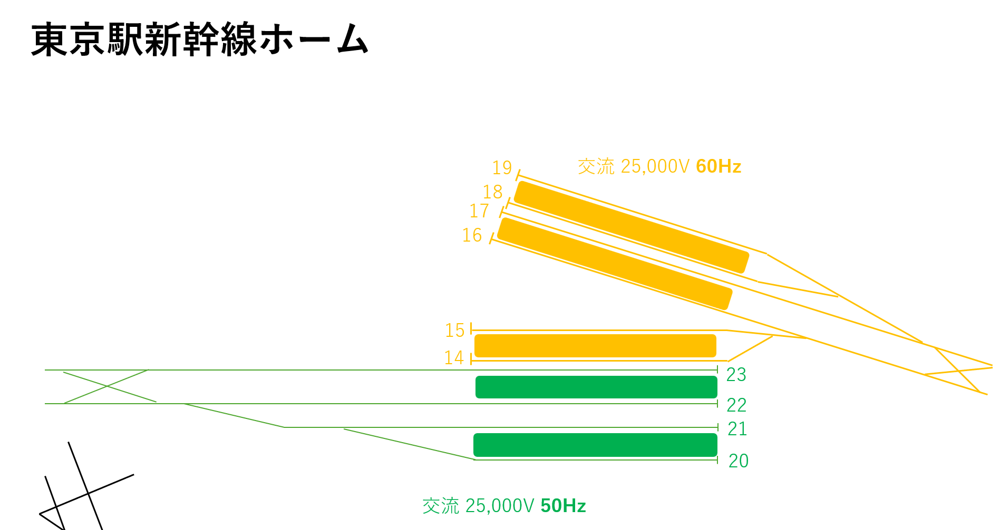</td>
  </tr>
  <tr>
    <td align="center"><図1></td>
  </tr>
</table>

②旧14番線を東海道新幹線から切り離す。またこのタイミングで旧14番線ホームのホームドアを撤去する。

<table align="center" style="border: none;">
  <tr>
    <td align="center">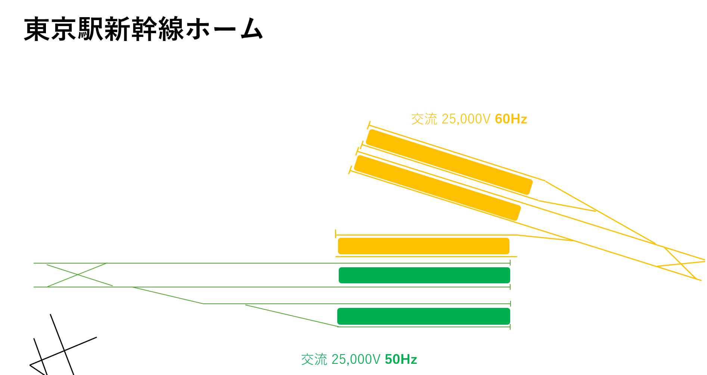</td>
  </tr>
  <tr>
    <td align="center"><図2></td>
  </tr>
</table>

③東北新幹線に接続する

<table align="center" style="border: none;">
  <tr>
    <td align="center">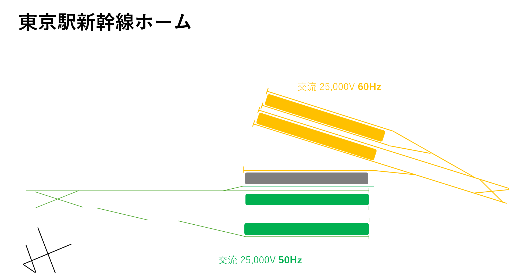</td>
  </tr>
  <tr>
    <td align="center"><図3></td>
  </tr>
</table>

④現状は11\~13番線が欠番で、連続になっていないため、在来線に続き東北新幹線ホームから順に11\~20番線とする。

<table align="center" style="border: none;">
  <tr>
    <td align="center">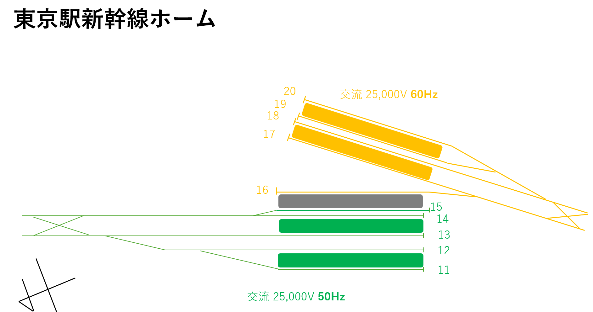</td>
  </tr>
  <tr>
    <td align="center"><図4></td>
  </tr>
</table>

対面乗り換えホームは15・16番線となる。

②では東海管轄のホームにのみ存在するホームドアを撤去しなければならない。なぜなら両社で車両の規格が異なりホームドアをそのまま使うことができないためである。

<table align="center" style="border: none;">
  <tr>
    <td align="center">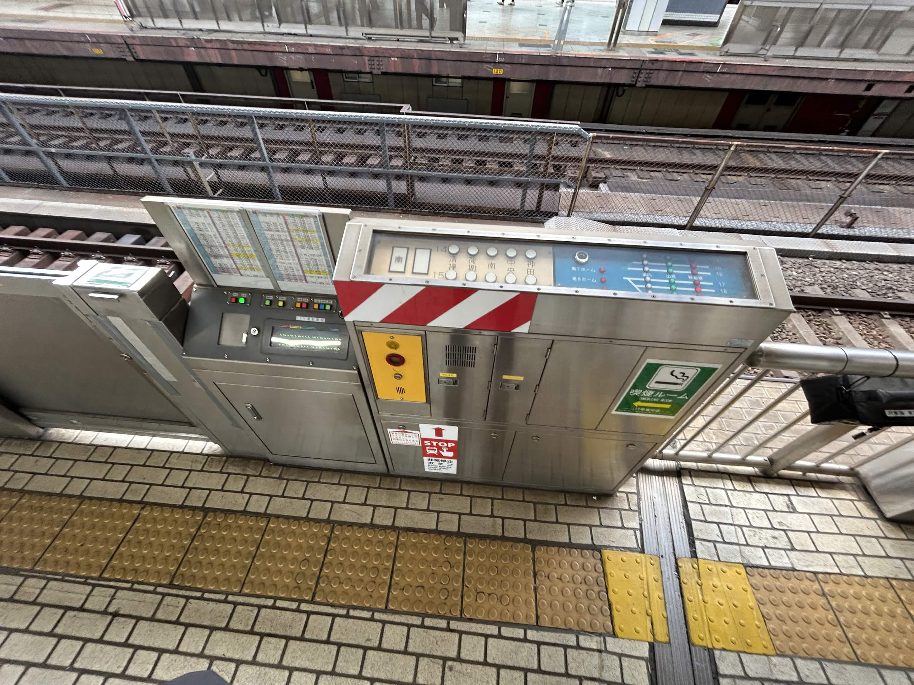</td>
    <td align="center">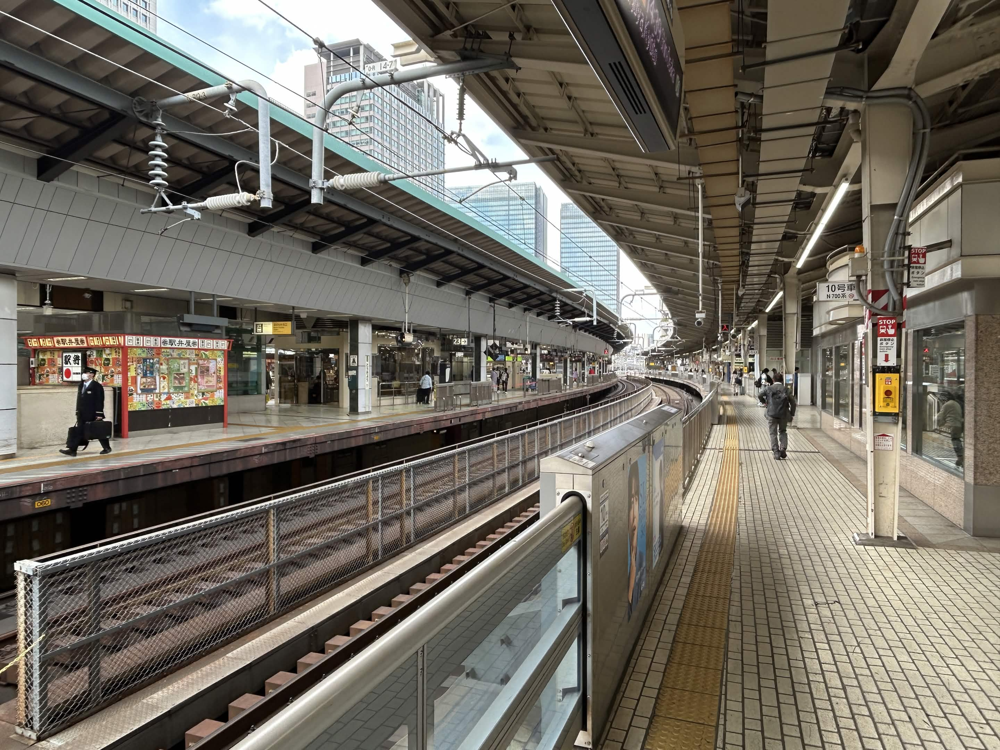</td>
  </tr>
  <tr>
    <td align="center"><画像1></td>
    <td align="center"><画像2></td>
  </tr>
</table>

右の画像を見ると、手前の東海道新幹線ホームはホームドアがあるが、東北新幹線ホームにはない

## 3. 期待される効果

この計画では以下のような効果が期待される

1. 東京駅をまたいだ新幹線利用時間の短縮
2. 「ひかり」「やまびこ」などの停車駅の多い種別の利用客の増加
3. 東北・北海道・秋田・山形・上越・北陸新幹線の増発可能キャパシティの確保

1と3は言うまでもないが2については飛行機と比べた場合の時間で比較して説明できる。長距離を走る上級種別(「のぞみ」や「はやぶさ」など)であれば東京駅で乗り換えてまたどこかへ高速種別で移動するというのは導線として考えづらい。例えば「はやぶさ」と「のぞみ」で仙台から大阪に移動する場合は新幹線での合計所要時間は100+150[分]≒4時間+αである。これならば初めから仙台空港から伊丹空港や関西国際空港に飛んでしまえば約1時間半、待ち時間を含めても圧倒的に早いのである。青森や博多を持ってくればこの差はもっと広がってしまう。そのため、高崎から熱海、新富士から宇都宮といった飛行機を使いづらい区間の需要増加が主となるだろう。そのため、**対面乗り換えホームでは、できるだけ下級種別を優先して止めるようにする必要がある。**

## 4. 課題

### 合意形成を妨げる要因

JR東日本(以下JR東)およびJR東海(以下東海)の合意を妨げる要因としては以下のようなものが考えられる。

- 工事の費用負担
- 改札の扱い
- 契約テナントの撤退or共存

この中で一番決めるのが難しいと思われるのが工事の費用負担である。現在、14・15番線は東海が使用しているものの、新幹線ホームとしては当初東北新幹線ホームとして建設された(※1)。辛うじて2面4線で回しているものの、清掃時間が足りないときは上野駅に回送して清掃完了後に東京駅に戻すというようなやりくりをしている。JR東としてはこれを根拠に東海に譲歩を求める可能性がある。企業間だけでの落とし込みが難しい場合は東京都や国に仲介を仰ぐなどの対策が求められる。

※1 国鉄時代、東京駅は今の東海が使用している16~19番線の4つの番線が東海道新幹線、現14・15番線および東北新幹線の22・23番線が東北新幹線ホームとして建設された。しかし、東海道新幹線の開業から東北新幹線の開業までは期間が空き、まだ使わない14・15番線ホームを一時的に東海道新幹線ホームとして租借した。その後、東海道新幹線の需要増加と増発に伴い東北新幹線の開業後も14・15番線ホームを返還できなくなってしまった。や無負えず在来線ホームの1つを東北新幹線ホームに転用することで20\~23番線を確保して事なきを得たが、14・15番線が東北新幹線ホームとして作られた経緯から国鉄分割民営化の際に東海がJR東から買い取るという形をとった。

テナントは次に大きい問題である。地域重身の遺構などは気にしなくていい本案件だがJR東、東海以外ではテナントが関係する他社ということになる。現在はJR東のホームと東海のホームでは完全に契約形態が別になっている。

<table align="center" style="border: none;">
  <tr>
    <td align="center">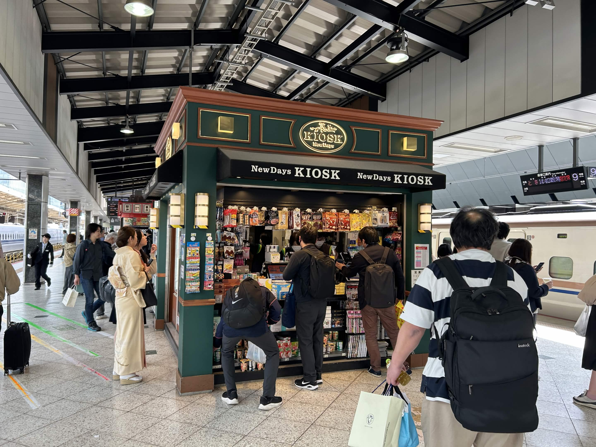</td>
    <td align="center">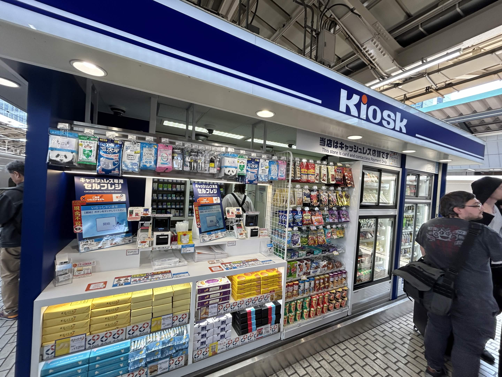</td>
  </tr>
  <tr>
    <td align="center"><画像3>東北新幹線ホームの売店</td>
    <td align="center"><画像4>東海道新幹線ホームの売店</td>
  </tr>
</table>

キオスクは両社と契約しているため、14・15番線ホームの売店は東海の契約に基づいて営業している。もし、14・15番線ホームをJR東に転用したとしても引き続き営業するすることができるだろう。問題は次である。

<table align="center" style="border: none;">
  <tr>
    <td align="center">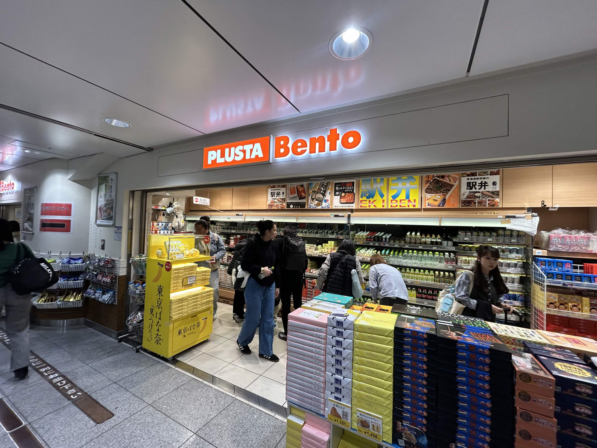</td>
  </tr>
  <tr>
    <td align="center"><画像5>ホーム下のテナント</td>
  </tr>
</table>

プラスタ弁当は東海のグループ企業であるJR東海リテイリング・プラスが運営しており、テナントとして東海と契約しているため、14・15番線ホームをJR東に転用した場合、契約を解除するか新たにJR東と契約するか迫られることになる。

### 技術的な課題

直通運転程ではないが大規模な工事とそのためのスペース確保が求められる。

<table align="center" style="border: none;">
  <tr>
    <td align="center">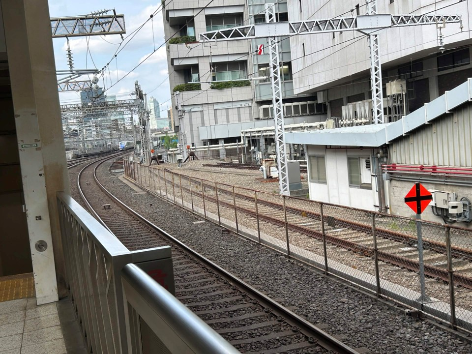</td>
  </tr>
  <tr>
    <td align="center"><画像6>東北新幹線と接続する予定部分</td>
  </tr>
</table>

この狭いスペースだけで工事を無事終えるのは難しいと思われる。

## 5. 他の案ではダメな理由

### 直通運転計画

**メリット**

利用客による利便性は一番高くなる。理論上、鹿児島から札幌まで走る新幹線が誕生する可能性がある(所要時間・料金で比べると飛行機には絶対に勝てないため実用性はあまりないが)

**デメリット**

技術的に問題が多すぎる。例えば、両社の交流電化周波数が違うことから接続するにはホームのどちらかの端にデットセクション(※2)を設ける必要がある。50Hzと60Hz両方に対応している新幹線(W7系など)自体は既にあるので新たに車両を開発する必要はあまりないが、スペースの少ない東京駅に設置するとなると新たな土地を取得する必要が出てくるだろう。

<table align="center" style="border: none;">
  <tr>
    <td align="center">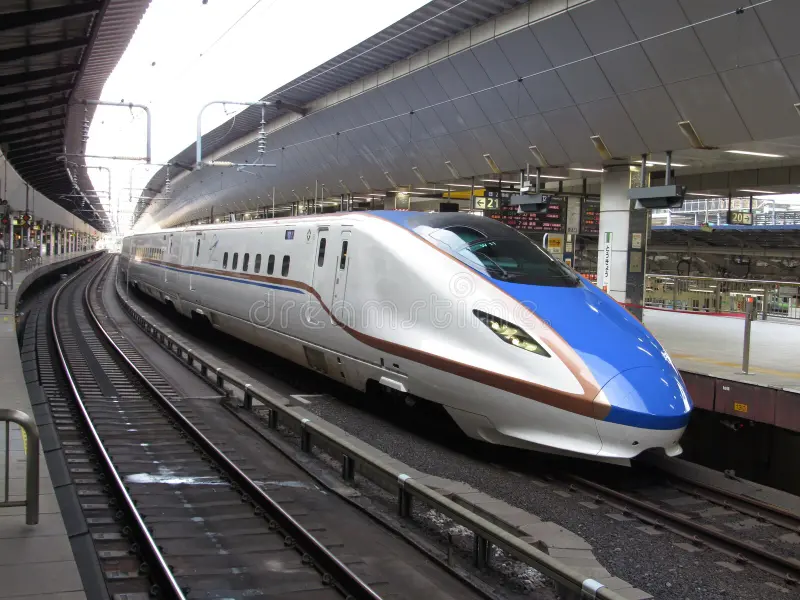</td>
  </tr>
  <tr>
    <td align="center"><画像7>W7系</td>
  </tr>
</table>

引用:https://www.dreamstime.com/e-series-has-operated-march-also-operates-j-etsu-shinkansen-following-timetable-revision-w-hokuriku-was-extended-image267456990

加えて直通線路網が膨大となり、遅延の波及が大きくなってしまう。

※2 デットセクションとは電化方式や形式が異なる場合に走りながらその境界を跨げるようにする場所である。今回のように交流周波数が異なる地域の境界や直流電化区間と交流電化区間を繋ぐためにある。新幹線の場合、北陸新幹線に3箇所存在するが、新幹線駅構内での事例は国内にはない。工事が難しく、費用が膨大になり、駅には利用客がいる状況でスペースの狭い東京駅にデットセクションを設けるのは危険と言えるだろう。

### 14・15番線ホームを丸ごとJR東に変換する。

**メリット**

ホーム及びその下の空間を丸ごとJR東の改札にしてしまえばいいので改札は引き続き別にしておくことが可能。東海は不要となったホームの維持管理費及び租借費用を払わなくて済む。JR東は不足しているホームを獲得できる。これにより、清掃のための時間をより確保できる。

**デメリット**

利用客の利便性は向上しない。加えて東海と契約して14・15番線ホームに入っているテナントは完全に撤退するか新たにJR東と契約するか迫られることになる。

### 現状維持

**メリット**

費用が一切かからない

**デメリット**

運行本数に対して、設備が過剰なので維持費が負担となる。また、ほとんど列車が来なくなったホームのテナントが撤退する可能性がある。JR東はただでさえホームが不足しているのだから何らかの形で移管する必要があるといえるだろう。

## 6. まとめ

本計画（CE計画）は、リニア新幹線開業を契機に、東海道新幹線が使用する東京駅14番線をひっ迫している東北新幹線ホームへ転用し、14・15番線で東海道・東北両新幹線の対面乗り換えを実現するものである。旧14番線を東海道新幹線から切り離してホームドアを撤去し、東北新幹線側へ接続したうえで、欠番となっている番線を整理して在来線側から順に付番し直す。

この計画により、①東京駅をまたぐ新幹線利用時間の短縮、②「ひかり」「やまびこ」など停車駅の多い下級種別の利用客増加、③東北・北海道・秋田・山形・上越・北陸各新幹線の増発キャパシティ確保が期待される。特に、飛行機と競合しにくい中距離区間の需要増が中心となるため、対面乗り換えホームにはできるだけ下級種別を優先して停車させる運用が望ましい。

一方で、実現には課題も残る。合意形成上は、工事の費用負担・改札の扱い・契約テナント（キオスクやプラスタ弁当など）の撤退／共存が焦点となり、特に14・15番線の建設経緯を巡る費用負担はJR東日本とJR東海の企業間だけでは調整が難しく、東京都や国の仲介が必要となる可能性がある。技術面でも、東北新幹線との接続部の狭いスペースで大規模工事を安全に完了させることが課題となる。

代替案と比較しても、直通運転計画は利便性こそ最も高いが交流電化周波数の相違に伴うデッドセクション設置など技術的・費用的リスクが大きく、ホームを丸ごとJR東日本へ移管する案や現状維持案は利便性向上につながらない。これらを踏まえると、実現可能性と効果のバランスに優れる本計画が最も合理的な選択肢であると結論づけられる。

## 7. 感想

この計画が実現すれば下の画像のホームに左右で異なる会社の車両が止まることになる。鉄道ファンならば間違いなく一度は来てくれる名所になると思う。利便性や混雑緩和の面でも大きな効果が期待できるが個人的にはそれだけ目的として十分だと思う。この計画自体には抗菌を投入する計画などもないので反対意見も多くはないだろう。

<table align="center" style="border: none;">
  <tr>
    <td align="center">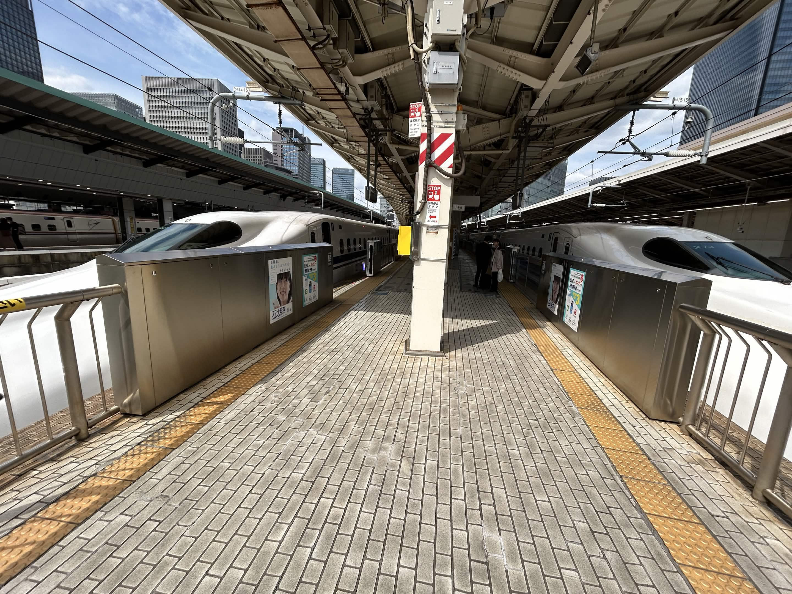</td>
  </tr>
  <tr>
    <td align="center"><画像8>14・15番線ホームの品川方面の末端</td>
  </tr>
</table>

## 7. 参考文献

画像7以外は自分が現地で撮影

乗りものニュース:
[trafficnews.jp/post/79680](https://trafficnews.jp/post/79680)

日本経済新聞:
https://www.nikkei.com/article/DGXNASFK2903Y_Z20C14A1000000/?msockid=0b5644480ed260e80f5d51b30fa86158

W7系の画像
[www.dreamstime.com/e-series-has-operated-march-also-operates-j-etsu-shinkansen-following-timetable-revision-w-hokuriku-was-extended-image267456990](https://www.dreamstime.com/e-series-has-operated-march-also-operates-j-etsu-shinkansen-following-timetable-revision-w-hokuriku-was-extended-image267456990)
